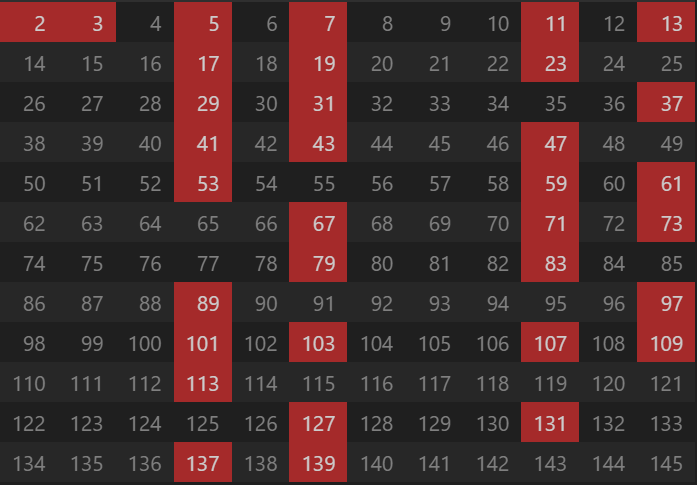

# 再谈素数

大家都知道素数是乘法世界的基础，素数奇怪和不可捉摸的性质，比如素数产生没有规律，素数的数量是无限的。

这里想和大家从素数的定义再来看看素数的性质。

## 构造素数规则

### 抽取第一个素数及其倍数

在一堆自然数列表中，我们抽掉所有为2倍数的数会形成如下表格，其中被抽调的用灰色表示，剩余的用绿色表示，后续的 **素数必然在绿色** 中构造：

从质数2向后看，除了2本身之外，所有的素数必然可以写成： $` \{2m + 1 | m \in \mathbb{Z} \} `$ 的形式，这就是我们常见的奇数。

后续素数产生的概率为： $` \frac{1}{2} `$ 。

### 抽取素数3及其倍数

选取剩余的数中的第一个3，抽调3的倍数的数，更新表格如下：

剩下的所有素数均在绿色的区域产生，**所以除了2、3本身，所有的素数必然可以写成：$` (6m - 1) 或 (6m +1) `$ 。**

$$
\{ 2k + 1 | k \in \mathbb{Z} \} \setminus \{ 3j | j \in \mathbb{Z} \}
 = \{ (6m \pm 1) | m \in \mathbb{Z} \}
$$

后续素数产生的概率为： $` \frac{1}{3} `$ ， 对于孪生素数仅仅考虑其中的最小素数参数，其概率为： $` \frac{1}{6} `$。

在引入新的素数之前，素数产生的位置是有规律的，2和3过滤之后，所有的剩余的数均按照孪生素数的行为排列，这是 **孪生素数产生的基础** 。

### 抽取素数5及以后素数的倍数

继续抽数，选取剩余的数中的第一个5，抽调5的倍数的数，更新表格如下：

其实到这一步我们要说的素数生成规则已经全部展现了，这是从自然数2开始拿掉第一个绿色数的倍数数字，不断让所有的表格中的绿色变成其它颜色。

**从自然数5开始引入的素数，让剩余素数选取规律不在那么明显，且越往后越无序**。

当引入素数5之后，自然数中质数存在的概率变更低，但是质数的出现的可能形式变得更加多了，**所以除了2，3，5本身外**，所有的素数必然可以写成：

$$
\{ (6k \pm 1) | k \in \mathbb{Z} \}  \setminus \{ 5j | j \in \mathbb{Z} \} = \{ (30m \pm 13) \cup (30m \pm 11) \cup (30m \pm 7) \cup (30m \pm 1) | m \in \mathbb{Z} \}
$$ 

后续素数产生的概率为： $` \frac{4}{15} `$ ，孪生素数的概率为：$` \frac{1}{10} `$ 。

这种概率减少总类增加的性质加速了下一个素数位置的随机性，这也是质数定义本身来的的规律，但在产生随机性的同时，也有一些规律性。

在引入了7之后，所有的素数必然可以写成如下形式之一：

$$
\{ 
    (210m \pm 1), (210m \pm 31), (210m \pm 61), (210m \pm 91),   \\
    (210m \pm 7), (210m \pm 37), (210m \pm 67), (210m \pm 97),   \\
    (210m \pm 11), (210m \pm 41), (210m \pm 71), (210m \pm 101), \\
    (210m \pm 13), (210m \pm 43), (210m \pm 73), (210m \pm 103), \\
    (210m \pm 17), (210m \pm 47), (210m \pm 77), (210m \pm 107), \\
    (210m \pm 19), (210m \pm 79), (210m \pm 109), \\
    (210m \pm 23), (210m \pm 53), (210m \pm 83), (210m \pm 113), \\
    (210m \pm 29), (210m \pm 59), (210m \pm 89), \\
    (210m \pm 31), (210m \pm 61) \\
    | m \in \mathbb{Z} \}
$$

后续素数产生的概率为： $` \frac{8}{35} `$ ，孪生素数的概率为：$` \frac{1}{14} `$ 。

在这一步之后，我们可以得到一个明确结论：**素数的特性传递**，什么意思呢？

$$
无论是引入2之后的\{ 2k + 1 | k \in \mathbb{Z} \}特性还是引入3之后的\{ (2 \cdot 3 \cdot m \pm 1) | m \in \mathbb{Z} \}，将会永远传递下去，\\
总是会存在 \{ (2 \cdot 3 \ldots p \cdot m \pm 1) | m \in \mathbb{Z} \}，\\
依次类推，所有新引入素数p产生的其它特性都会传递。
$$

**这个性质不能用于寻找素数，因为特性传递的速度远远大于素数产生的速度**，但在引入素数 $P$ 之后，特性将会向前拟合，就是特性的发散的目标总是尝试拟合已知素数的规律。

当表格中所有的绿色全部消失后，这个表看起来像这样：

## 孪生素数是无限的吗？

我们都知道素数是无限的，因为我们总是可以构造一个 $` p_1 \cdot p_2 \cdot p_3 \ldots p_n + 1, (其中 p_1，p_2, p_3, \ldots , p_n 为所有已知素数列表) `$ ， 那 **孪生素数或者是多胞胎素数** 呢？

“从直观感受上来看，孪生素数的减少是因为新产生素数的倍数规则消掉了以 $` 2 \cdot 3 `$ 预留的 **可能素数产生位** ， 考虑到所有素数是互质的，那么 $` (2 \cdot 3)  和 (5 \cdot 7 \cdot 9 \cdot 11 \ldots \ p_n) `$ 也互质，当数足够大之后，**100%** 同时命中 $` (6m - 1 ) 或 (6m + 1) `$ 是矛盾的，即 $` gcd(2 \cdot 3 , 5 \cdot 7 \cdot 9 \cdot 11 \ldots \ p_n) > 1 `$ , 这个结论是违背我们素数的定义的”。

上面的结论其实无法证明，当质数增加时，遮盖 $` (6m - 1) 或 (6m + 1) `$ 的概率也越来越大，但永远达不到 **100%（孪生素数出现概率趋近于0）** ,暂时无法证明是不是会出现后面素数交替覆盖而达到让孪生素数不出现的情况。

### 能用反证法吗？

可以，在明确素数特性100%传递的基础之上，假如在达到一个非常大的素数 $p$ 之后，不再出现新的孪生素数，那么我们可以再构造一个这样的数：

$$
    2 \cdot 3 \cdot 5 \ldots p \cdot p_m \ldots p_n \cdot p_k \\
    如果在将 p_m \ldots p_n 中所有的素数全部找出来（它们在区间2 \cdot 3 \cdot 5 \ldots p 到 2 \cdot 2 \cdot 3 \cdot 5 \ldots p），那么 p_k 之后的素数将会丢掉 \{ (2 \cdot 3 \ldots p_k \cdot m \pm 1) | m \in \mathbb{Z} \} 这个特性 \\
    这个违背了素数产生的基本规律，故不存在最大的孪生素数对。
$$

由于素数的规律，不可能出现一个规律性的公式能够绝对匹配素数，但素数特性传递的规律又像在证明一个事实：

$$
    凡是可能出现（概率大于0），必然会出现。
$$

## 未完待续

