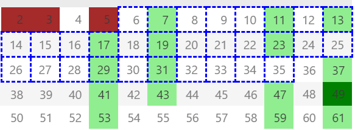

# Distribution Patterns of Prime Numbers and a Proof of the Infinitude of Twin Primes

**Author**: Gene Kong  

**Abstract**: This paper proposes a model for the distribution of prime numbers based on modular structure by analyzing the characteristics of sieve methods in prime generation. By constructing residual number sets after sieving with primes such as 2, 3, 5, etc., we reveal the periodic distribution features of "sieve residues" and demonstrate that such characteristics persist in subsequent sieving processes. Furthermore, using proof by contradiction, we analyze the infinitude of twin primes. We argue that the inherent persistence of candidate twin prime pairs provides theoretical support for the unbounded existence of twin primes.  

**Keywords**: Prime distribution; Twin Prime Conjecture; Sieve methods; Modular structure; Property preservation; Sieve residues; Candidate twin primes  

## 1. Introduction  

The Twin Prime Conjecture—whether there exist infinitely many prime pairs of the form $(p, p+2)$—remains one of the central unsolved problems in number theory. Although Zhang [@zhang2014bounded], Maynard [@maynard2015small], and Castryck [@castryck2014new] have proven the existence of infinitely many prime pairs with gaps less than 70 million via bounded gap methods, narrowing this interval to exactly 2 still requires groundbreaking theoretical tools. This paper approaches the problem from an extended perspective of the Sieve of Eratosthenes, proposing a modular structure-based model for prime distribution and exploring the infinitude of twin primes through the persistent properties of candidate twin prime pairs.  

## 2. Definitions and Notations  

**Definition 2.1 (Sieve Residues)**: For a given sequence of primes $p_1, p_2, \ldots, p_k$ , natural numbers not eliminated by this sequence are termed **sieve residues**, denoted as $\mathcal{S}(p_1, p_2, \ldots, p_k)$ .  
**Definition 2.2 (Candidate Twin Primes)**: If adjacent elements $(q, q+2)$ exist in the sieve residue set, they are termed **candidate twin primes**.  

**Note**: Sieve residues may be genuine primes or unsieved composites, but their distribution follows periodic patterns dictated by the sieve method.  

## 3. Analysis of Prime Sieving Patterns  

### 3.1 Initial Sieving Stages  

- **Prime 2**: After eliminating all even numbers, the sieve residues form the odd number set $\{2m+1 \mid m \in \mathbb{Z}\}$ (see Appendix Figure 1).  
- **Prime 3**: Further eliminating multiples of 3, the residues become $\{6m \pm 1 \mid m \in \mathbb{Z}\}$ (see Appendix Figure 2). At this stage, the probability of candidate twin primes with a gap of 2 is $\frac{1}{6}$.  

### 3.2 Advanced Sieving Stages  

After introducing a prime $p_k$, the **sieve residue** set can be expressed as:  

$$
\mathcal{S}(2,3,\ldots,p_k) = \bigcup_{i} \begin{Bmatrix} \left( \prod_{j=1}^k p_j \cdot m \pm a_i \right) \mid m \in \mathbb{Z} \end{Bmatrix},
$$  

where $a_i$ are offsets coprime to $\prod_{j=1}^k p_j$. For example, introducing 5 yields the residue set $\{30m \pm 1, \pm 7, \pm 11, \pm 13\}$ (see Appendix Figure 3).  

The sieve residue set exhibits a cyclic period of $\prod_{j=1}^{k} p_j$ after introducing $p_k$, where $p_1 \ldots p_j$ denotes the consecutive prime sequence from 2 to the $k$-th prime. Each new prime extends the period while preserving residue patterns.  

**Theorem 3.1 (Preservation of Candidate Twin Prime Properties)**: For any prime sequence $p_1, p_2, \ldots, p_k$, the distribution properties of sieve residues generated by the sieve method satisfy the following when introducing a new prime $p_{k+1}$ ($p_{k+1} > 3$):  

- **Retention of ±1 Candidate Pairs**: Candidate twin prime pairs of the form $\prod_{j=1}^k p_j \cdot m \pm 1$ are retained unless $\prod_{j=1}^k p_j \cdot m \equiv \pm 1 \pmod{p_{k+1}}$ (specific values depend on modular arithmetic). The next candidate pair $\prod_{j=1}^{k+1} p_j \cdot m \pm 1$ will definitely be preserved;  
- **Proportion Retained Per Cycle**: A fraction $\frac{p_{k+1}-2}{p_{k+1}}$ of incremental candidate twin prime pairs remain unaffected by the new prime;  
- **Incremental Count Per Cycle**: Within the period $\prod_{j=1}^{k+1} p_j$, at least $p_{k+1}-2$ incremental candidate twin prime pairs are preserved.  

**Proof**: Consider candidate twin prime pairs $\prod_{j=1}^k p_j \cdot m \pm 1$. Since $p_{k+1}$ is coprime to $\prod_{j=1}^k p_j$, by modular arithmetic:  

$$
\prod_{j=1}^k p_j \cdot m \pm 1 \not\equiv 0 \pmod{p_{k+1}} \quad \text{unless} \quad m \equiv \pm \left( \prod_{j=1}^k p_j \right)^{-1} \pmod{p_{k+1}}.  
$$  

Thus, only when $m$ satisfies the above congruence are the candidate pairs eliminated. The remaining $\frac{p_{k+1}-2}{p_{k+1}}$ proportion of pairs persists, corresponding to $p_{k+1}-2$ preserved incremental pairs within the extended period $\prod_{j=1}^{k+1} p_j$.  

## 4. Proof by Contradiction for the Infinitude of Twin Primes  

Assume there exists a largest twin prime pair $(P, P+2)$. Then, for all $n > P$, the sieve residue set $\mathcal{S}(2,3,\ldots,p_k)$ must not contain any candidate twin prime pairs $(q, q+2)$ that are not covered by actual primes. However, Theorem 3.1 ensures that such candidate pairs persist with a positive proportion in every sieving stage and their count within each period $\prod_{j=1}^{k} p_j$ is no less than $p_k - 2$. This contradicts the assumption of a "largest twin prime pair." 

**Conclusion 4.1**: Within the cyclic period $\prod_{j=1}^{k} p_j$, the incremental preservation of candidate twin prime pairs is always no less than $p_k - 2$. Therefore, twin primes are infinite.  

## 5. Discussion and Future Directions  

1. **Extensions**: Investigating the infinitude of prime pairs with generalized gaps (e.g., 6, 12) or combining other models to explore additional preservation laws for candidate twin primes.  

## 6. Conclusion  

By constructing a periodic model of prime sieving, this paper demonstrates the persistent existence of candidate twin primes and infers the infinitude of twin primes via proof by contradiction.  

**Appendix**  

Figures illustrate sieved primes (brown), periodic sieve residue sets (boxed), and unsieved composites (dark green).  

{ width=65% }  
Figure 1: Residue distribution after sieving multiples of 2  

{ width=65% }  
Figure 2: Residue distribution after sieving multiples of 2 and 3  

{ width=65% }  
Figure 3: Residue distribution after sieving multiples of 2, 3, and 5  

Additional combinations may be analyzed using the tools provided in this document.  

**Code Availability Statement**  

The manuscript, experimental tools, and data are hosted on GitHub:  

* Repository: https://github.com/GeneKong/primes  
* Version: v1.0.0 (Release Date: March 2025)  
* DOI: 10.5281/zenodo.15071343  

**References**  