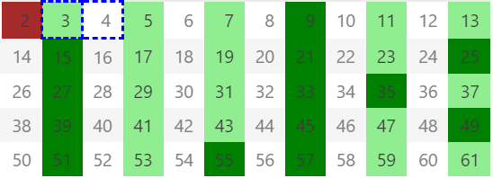
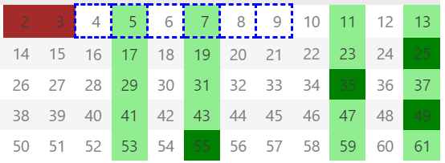
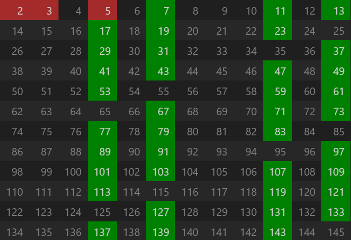

# 素数分布规律及其在孪生素数无限性中的推论

作者：GeneKong

摘要：本文通过分析素数生成过程中的筛法特性，提出了一种基于模数结构的素数分布规律模型。通过构造2、3、5等素数筛后的剩余数集，揭示了“伪素数”的周期性分布特征，并论证了此类特性在后续筛法中的传递性。进一步地，结合反证法分析了孪生素数无限性的可能性，指出特性传递的不可消除性为孪生素数的无限存在提供了理论支持。

关键词：素数分布；孪生素数猜想；筛法；模数结构；特性传递

## 1. 引言

孪生素数猜想（即是否存在无穷多对形如 $(p, p+2)$ 的素数）是数论中的核心未解问题之一。尽管张益唐[1]通过有界间隔方法证明存在无穷多对间隔小于7000万的素数，但将间隔严格缩小至2仍需突破性理论工具。本文从埃拉托斯特尼筛法（Eratosthenes sieve）的扩展视角出发，提出一种基于模数结构的素数分布模型，并尝试通过特性传递规律对孪生素数的无限性进行探讨。

## 2. 定义与符号约定  

**定义2.1（伪素数）**：对于给定素数序列 $p_1, p_2, \ldots, p_k$ ，称未被该序列筛除的自然数为**伪素数**，其集合记为 $\mathcal{S}(p_1, p_2, \ldots, p_k)$ 。  
**定义2.2（伪孪生素数）**：若伪素数集合中存在相邻元素 $(q, q+2)$ ，则称其为**伪孪生素数**。  
**注**：伪素数可能为真实素数或未被筛除的合数，但其分布遵循筛法的周期性规律。

## 3. 素数筛法的特性传递  

### 3.1 初始筛阶段

- **素数2**：筛除所有偶数后，剩余伪素数为奇数集 $\{2m+1 \mid m \in \mathbb{Z}\}$（图1）。  
- **素数3**：进一步筛除3的倍数，剩余伪素数为 $\{6m \pm 1 \mid m \in \mathbb{Z}\}$（图2），此时伪孪生素数间隔为2的概率为 $\frac{1}{6}$ 。  

### 3.2 高级筛选阶段

引入素数 $p_k$ 后，**伪素数** 集可表为：
$$
\mathcal{S}(2,3,\ldots,p_k) = \bigcup_{i} \left\{ \left( \prod_{j=1}^k p_j \cdot m \pm a_i \right) \mid m \in \mathbb{Z} \right\},
$$  
其中 $a_i$ 为与 $\prod_{j=1}^k p_j$ 互质的偏移量。例如，引入5后，伪素数集为 $\{30m \pm 1, \pm 7, \pm 11, \pm 13\}$ （图3）。  

**定理3.1（特性传递不变性）**：对于任意素数序列 $p_1, p_2, \ldots, p_k$ ，其筛法生成的伪素数分布特性在引入新素数 $p_{k+1}$ 时部分保留，且保留比例为 $\frac{p_{k+1}-2}{p_{k+1}}$ 。  

**证明**：新素数 $p_{k+1}$ 仅筛除 **伪素数集** 中模 $p_{k+1}$ 同余于0或特定值的元素，其余 $\frac{p_{k+1}-2}{p_{k+1}}$ 比例的伪孪生素数对得以保留。

## 4. 孪生素数无限性的反证法分析  

假设存在最大孪生素数对 $(P, P+2)$ ，则对于所有 $n > P$ ，伪孪生素数集 $\mathcal{S}(2,3,\ldots,p_k)$ 中必存在未被真实素数覆盖的候选对 $(q, q+2)$ 。由定理3.1，特性传递确保此类候选对在任意筛阶段均以正比例存在，与“无更大孪生素数”假设矛盾。  

**推论4.1**：若筛法特性传递的保留比例累积不趋于零，则孪生素数无限。 

## 5. 讨论与展望  

1. **局限性**：本文未严格量化特性传递的累积效应，需结合解析数论工具（如Bombieri-Vinogradov定理）进一步分析筛法密度。  
2. **扩展方向**：可研究广义间隔（如间隔6, 12等）的素数对无限性，或结合随机模型探讨特性传递的概率阈值。  

## 6. 结论  
通过构造素数筛法的周期性特性模型，本文论证了伪孪生素数的持续存在性，并基于反证法推测孪生素数无限。尽管严格证明仍需补充筛法密度的定量分析，但特性传递规律为孪生素数猜想提供了新的视角。

本文相关代码及实现已开源，可在GitHub仓库中获取：

GitHub Repository: https://github.com/GeneKong/primes.git

**参考文献**  
[1] Zhang Y. Bounded gaps between primes. *Annals of Mathematics*, 2014, 179(3): 1121-1174.  
[2] Maynard J. Small gaps between primes. *Annals of Mathematics*, 2015, 181(1): 383-413.  
[3] Tao T. Polymath8b: New equidistribution estimates of Zhang type. *arXiv preprint*, 2014.  

**附录**  
- 图1：筛除2的倍数后的伪素数分布 
- 图2：筛除2、3后的伪素数分布 
- 图3：筛除2、3、5后的伪素数分布 

