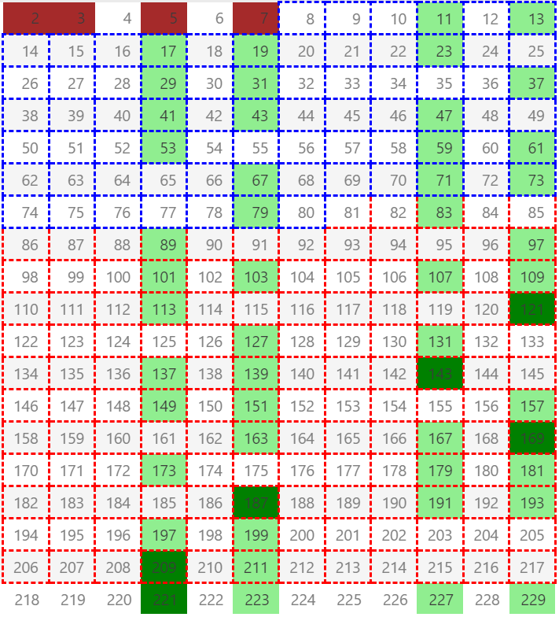

# 关于素数特性的描述和孪生素数无穷的说明

1. 本文发现了素数特性的潜在传播规律，即素数 $2 \cdot 3 \ldots p$ 产生的规律必然能在特定条件下100%预测素数；
1. 基于这个规律，证明孪生素数必然是无穷多对。

## 孪生素数猜想

孪生素数猜想（即是否存在无限多对相差2的素数）是数论中著名的未解问题。尽管近年来取得了一些突破性进展，例如张益唐在2013年证明存在无限多对素数间隔小于7000万，后续研究进一步缩小了这一间隔（目前最优结果已降至246），但严格证明间隔为2的孪生素数无限存在仍需更多理论突破。

**关键点总结：**

1. **已知结果**：已证明存在无限多对素数间隔小于某个有限值（如246）。
2. **未解问题**：间隔为2的具体情况（孪生素数）是否无限仍未解决。
3. **研究方向**：依赖更精细的筛法、解析数论工具或新思路，如广义黎曼猜想等，但尚无最终结论。

**结论**：孪生素数是否为无限尚未被证明或否定，目前仍为数学猜想。

## 构造素数规则

### 抽取第一个素数及其倍数

在一堆自然数列表中，我们抽掉所有为2倍数的数会形成如下表格，其中被抽调的用灰色表示，剩余的用绿色表示，后续的 **素数必然在绿色** 中构造：

从质数2向后看，除了2本身之外，所有的素数必然可以写成： $\{2m + 1 | m \in \mathbb{Z} \}$ 的形式，这就是我们常见的奇数。

**所有蓝色网格区域为必然命中区域，整个网格区为循环区域，下同**。

后续素数产生的概率为： $\frac{1}{2}$ 。

### 抽取素数3及其倍数

选取剩余的数中的第一个3，抽调3的倍数的数，更新表格如下：

剩下的所有素数均在绿色的区域产生，**所以除了2、3本身，所有的素数必然可以写成：$(6m - 1) 或 (6m +1)$ 。**

$$
\{ 2k + 1 | k \in \mathbb{Z} \} \setminus \{ 3j | j \in \mathbb{Z} \}
 = \{ (6m \pm 1) | m \in \mathbb{Z} \}
$$

后续素数产生的概率为： $\frac{1}{3}$ ， 对于孪生素数仅仅考虑其中的最小素数参数，其概率为： $\frac{1}{6}$。

在引入新的素数之前，素数产生的位置是有规律的，2和3过滤之后，所有的剩余的数均按照孪生素数的行为排列，这是 **孪生素数产生的基础** 。

### 抽取素数5及以后素数的倍数

继续抽数，选取剩余的数中的第一个5，抽调5的倍数的数，更新表格如下：

其实到这一步我们要说的素数生成规则已经全部展现了，这是从自然数2开始拿掉第一个绿色数的倍数数字，不断让所有的表格中的绿色变成其它颜色。

**从自然数5开始引入的素数，让剩余素数选取规律不在那么明显，且越往后越无序**。

当引入素数5之后，自然数中质数存在的概率变更低，但是质数的出现的可能形式变得更加多了，**所以除了2，3，5本身外**，所有的素数必然可以写成：

$$
\{ (6k \pm 1) | k \in \mathbb{Z} \}  \setminus \{ 5j | j \in \mathbb{Z} \} = \{ (30m \pm 13) \cup (30m \pm 11) \cup (30m \pm 7) \cup (30m \pm 1) | m \in \mathbb{Z} \}
$$ 

后续素数产生的概率为： $\frac{4}{15}$ ，孪生素数的概率为：$\frac{1}{10}$ 。

这种概率减少总类增加的性质加速了下一个素数位置的随机性，这也是质数定义本身来的的规律，但在产生随机性的同时，也有一些规律性。

在引入了7之后，所有的素数必然可以写成如下形式之一：

$$
\{
    (210m \pm 1), (210m \pm 31), (210m \pm 61), (210m \pm 91),
    (210m \pm 7), (210m \pm 37), (210m \pm 67), (210m \pm 97), 
    (210m \pm 11), (210m \pm 41), (210m \pm 71), (210m \pm 101),
    (210m \pm 13), (210m \pm 43), (210m \pm 73), (210m \pm 103),
    (210m \pm 17), (210m \pm 47), (210m \pm 77), (210m \pm 107), 
    (210m \pm 19), (210m \pm 79), (210m \pm 109),
    (210m \pm 23), (210m \pm 53), (210m \pm 83), (210m \pm 113),
    (210m \pm 29), (210m \pm 59), (210m \pm 89),
    (210m \pm 37), (210m \pm 67),
    (210m \pm 33)
    | m \in \mathbb{Z} \}
$$

后续素数产生的概率为： $\frac{8}{35}$ ，孪生素数的概率为：$\frac{1}{14}$ 。

在这一步之后，我们可以得到一个明确结论：**素数的特性传递**，什么意思呢？

$$
    \begin{gather}
    无论是引入2之后的\{ 2k + 1 | k \in \mathbb{Z} \}特性还是引入3之后的\{ (2 \cdot 3 \cdot m \pm 1) | m \in \mathbb{Z} \}，将会永远传递下去， \\
    总是会存在 \{ (2 \cdot 3 \ldots p \cdot m \pm 1) | m \in \mathbb{Z} \}， \\
    依次类推，所有新引入素数p产生的其它特性都会传递。
    \end{gather}
$$

**这个性质不能用于寻找素数，因为特性传递的速度远远大于素数产生的速度**，但在引入素数 $P$ 之后，特性将会向前筛选，就是特性的发散的目标总是尝试规避已知素数的规律。

当表格中所有的绿色全部消失后，这个表看起来像这样：

我们总结一下素数特性传播的规律：

1. 对于已知素数序列：$2 \cdot 3 \cdot 5 \ldots p$，特性 $\{ (2 \cdot 3 \ldots p \cdot m \pm k) | m \in \mathbb{Z} , k 为 1 \ldots 等 \}$，对区间 $p$ 到 $2 \cdot p$ 之间的素数预期准确率为100%；
2. 对于已知素数序列：$2 \cdot 3 \cdot 5 \ldots p$，特性 $\{ (2 \cdot 3 \ldots p \cdot m \pm k) | m \in \mathbb{Z} , k 为 1 \ldots 等 \}$，在不考虑后续素数产生的情况下，预期准确率为100%；
3. 引入新素数后，老素数产生的特性不会消失；
4. 每引入一个新素数之后，特性交替发散叠加向后传播，速度远大于素数生成的速率；

## 孪生素数是无限的吗？

我们都知道素数是无限的，因为我们总是可以构造一个 $p_1 \cdot p_2 \cdot p_3 \ldots p_n + 1, (其中 p_1，p_2, p_3, \ldots , p_n 为所有已知素数列表)$ ， 那 **孪生素数或者是多胞胎素数** 呢？

在明确素数新特性的基础之上，假如在达到一个非常大的素数 $p$ 之后，不再出现新的孪生素数，那么我们考虑这个数列的实际情况：

$$
    \begin{gather}
    2,3,5, \ldots p , p_m , p_n , p_k \\
    理论上p之后的预期必定存在\{ (2 \cdot 3 \ldots p \cdot m \pm 1) | m \in \mathbb{Z} \} 这个特性， \\
    而实际上已经没有孪生素数了，那这个情况违背:\\
    不考虑p后面再生成素数的情况下，预期必然命中的性质， \\
    故不存在最大的孪生素数对。
    \end{gather}
$$

由于素数的规律，不可能出现一个规律性的公式能够绝对匹配素数，但素数特性传递的规律又像在证明一个事实：

$$
    凡是可能出现（概率大于0），必然会出现。
$$

